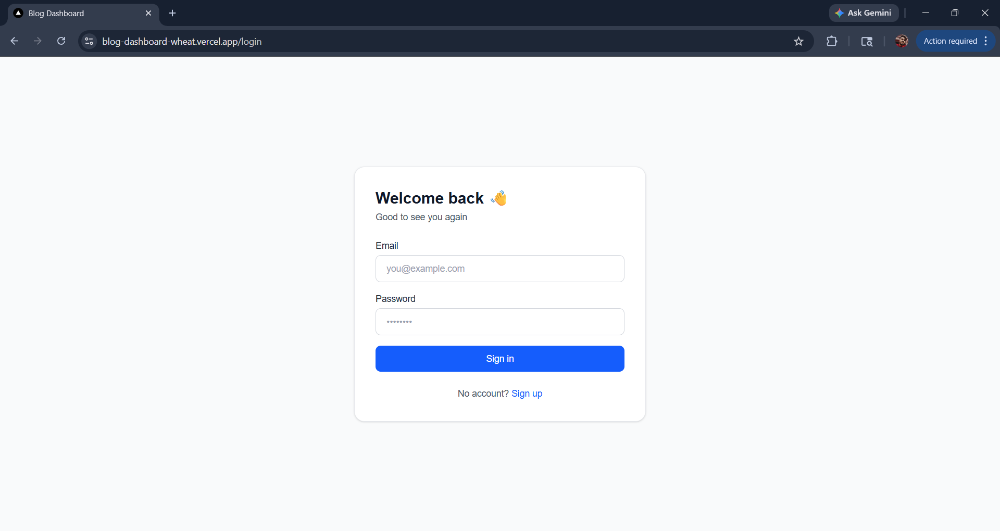
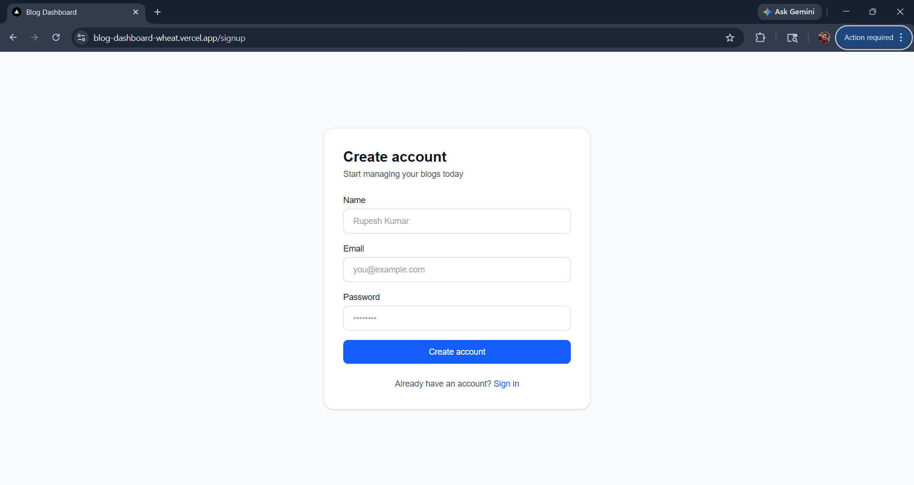
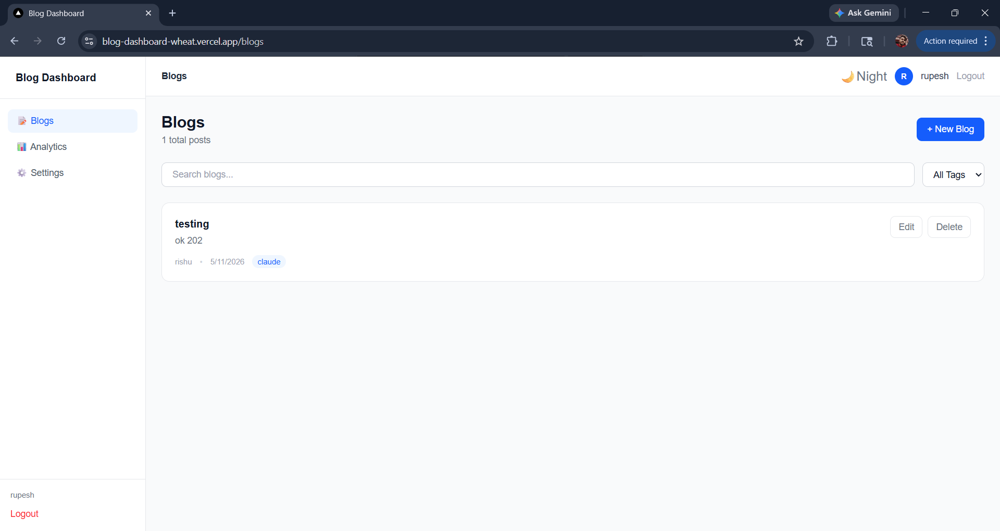
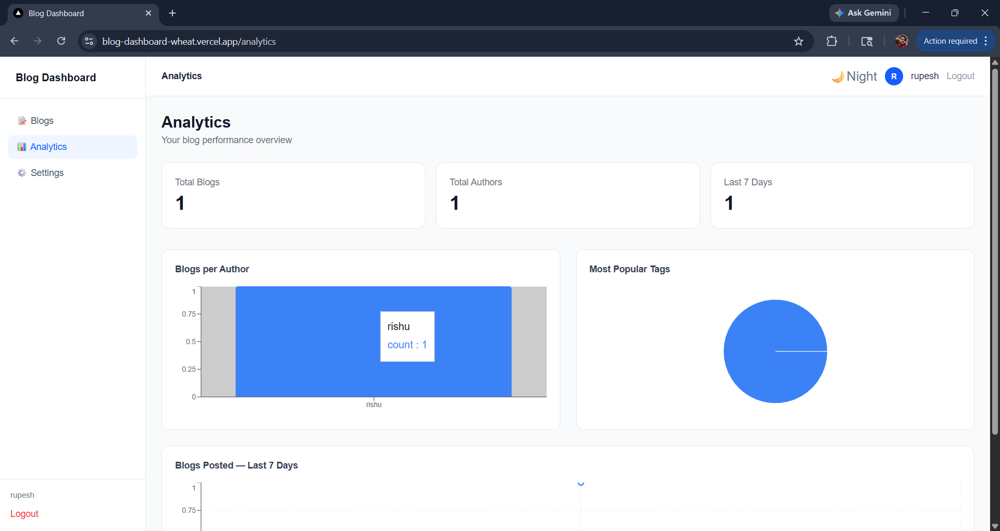

# Blog Dashboard

A full-stack blog management dashboard built with Next.js, Node.js, Express, and MongoDB.

## Live Demo

- Frontend: https://blog-dashboard-wheat.vercel.app
- Backend: https://blog-dashboard-api.onrender.com

---

## Tech Stack

| Layer | Technology |
|---|---|
| Frontend | Next.js 16, Tailwind CSS |
| State Management | Zustand |
| Backend | Node.js + Express |
| Database | MongoDB Atlas |
| Auth | JWT |
| Charts | Recharts |

---

## Features

- JWT authentication — signup, login, protected routes
- Blog CRUD — create, edit, delete with confirmation dialog
- Pagination — 6 blogs per page
- Real-time search by title with 500ms debounce
- Tag-based filtering
- Analytics dashboard — bar, pie, and line charts
- 4 MongoDB aggregation pipelines
- Fully responsive — mobile, tablet, desktop
- Dark mode toggle
- Collapsible mobile sidebar
- Settings page

---

## Screenshots

### Login


### Blogs


### Analytics


### Settings


---

## Project Structure
blog-dashboard/
├── client/
│   ├── app/
│   │   ├── (auth)/
│   │   └── (dashboard)/
│   ├── store/
│   ├── hooks/
│   └── lib/
└── server/
├── controllers/
├── models/
├── routes/
├── middleware/
└── config/

---

## Getting Started

### Prerequisites
- Node.js v18+
- MongoDB Atlas account

### Clone

```bash
git clone https://github.com/Rupeshgupta1/blog-dashboard.git
cd blog-dashboard
```

### Backend

```bash
cd server
npm install
npm run dev
```

### Frontend

```bash
cd client
npm install
npm run dev
```

Frontend: http://localhost:3000
Backend: http://localhost:5000

---

## Environment Variables

Create `server/.env`:
PORT=5000
MONGO_URI=your_mongodb_connection_string
JWT_SECRET=your_jwt_secret

---

## API Endpoints

| Method | Endpoint | Description |
|---|---|---|
| POST | /api/auth/signup | Register user |
| POST | /api/auth/login | Login, returns JWT |
| GET | /api/blogs | All blogs with search + filter |
| POST | /api/blogs | Create blog |
| PUT | /api/blogs/:id | Update blog |
| DELETE | /api/blogs/:id | Delete blog |
| GET | /api/analytics/per-author | Blogs per author |
| GET | /api/analytics/top-tags | Most used tags |
| GET | /api/analytics/recent | Last 7 days |
| GET | /api/analytics/summary | Total counts |

---

## Aggregation Pipelines

1. Blogs per Author — $group by authorName, sorted by count
2. Top Tags — $unwind tags, $group, $sort, $limit 10
3. Last 7 Days — $match date range, $group by date
4. Summary Stats — total blogs, authors, recent activity